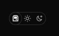

2-arrumar dominio do site???? verificar dia 19/12
1515-arrumar responsividade\*-- sobre 1012-add efeito no scroll
1212-Atualizar Tema 
1213-Adicionar Mudança de Idioma
1213.1 - não trduzir palavras chaves
5050-Colocar ChatBot/Integração com uma IA
8090-Add Drag Drop nas Habilidades
9009-Colocar captch e pedido de autorização pra utilização dos dados https://www.google.com/recaptcha/about/
1010-Add Esqueleto

10555-arrumar saves no localstora, quando tiver atulização, atualizar lá tbm

01/12/2024 - Criando Portifólio.
Atualizar Estacionamento!
Atualizar Dashboard

// async function gerarMenu() {
// const menuCache = localStorage.getItem("menuHTML");
// if (menuCache) {
// header.innerHTML = menuCache;
// return;
// }

// const menuHTML = menuItemsNav
// .map(
// (item) =>
// `<a href="${item.link}" class="btnMenu">${item.text}</img></a>`
// )
// .join("");
// const navHTML = `<nav>${menuHTML}</nav>`;
// localStorage.setItem("menuHTML", navHTML);
// header.innerHTML = navHTML;
// }

// function gerarFooter() {
// const footerCache = localStorage.getItem("footerHTML");
// if (footerCache) {
// footer.innerHTML = footerCache;
// return;
// }
// const footerHTML = menuItemsFooter
// .map((item) => {
// const hoverStyle =
// item.text !== "Instagram"
// ? `style="--hover-background-color: ${item.color}; --after-border-color: ${item.color} transparent transparent transparent;"`
// : `style="--hover-background-color: ${item.color};"`;
// return `
//         <a href="${item.link}" class="iconsFooter" ${hoverStyle}>
//           
//           ${item.text}
//         </a>`;
// })
// .join("");

// let menuFooter = `<ul>${footerHTML}</ul>`;
// localStorage.setItem("footerHTML", menuFooter);

// footer.innerHTML = menuFooter;
// }
